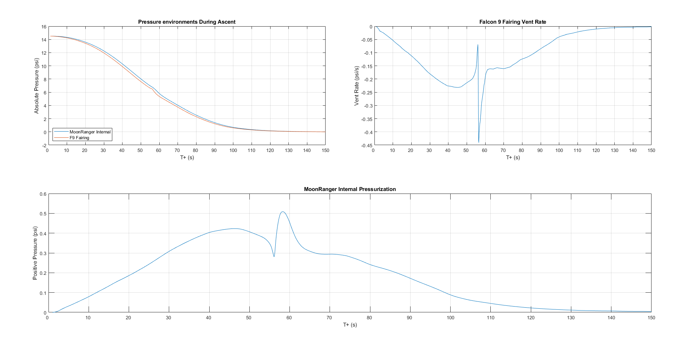

# Chassis Venting Analysis
This script predicts the internal over-pressure of the MoonRanger structural chassis during launch and ascent inside a Falcon 9 payload fairing. Data for the fairing pressure environment has been ripped from Figure 4-10 in the Falcon 9 Users Guide Rev 2.0 (https://www.mach5lowdown.com/wp-content/uploads/2020/04/falcon_9_users_guide_rev_2.0-1.pdf). 

This analysis uses a simple Euler's method approximation of the oriface discharge equations. The chassis vent is covered by a felt filter and the flow resistance per area has been determined experimentally. 

Below is an example output of the script for the 1.00" dia. vent hole selected for the flight rover.

