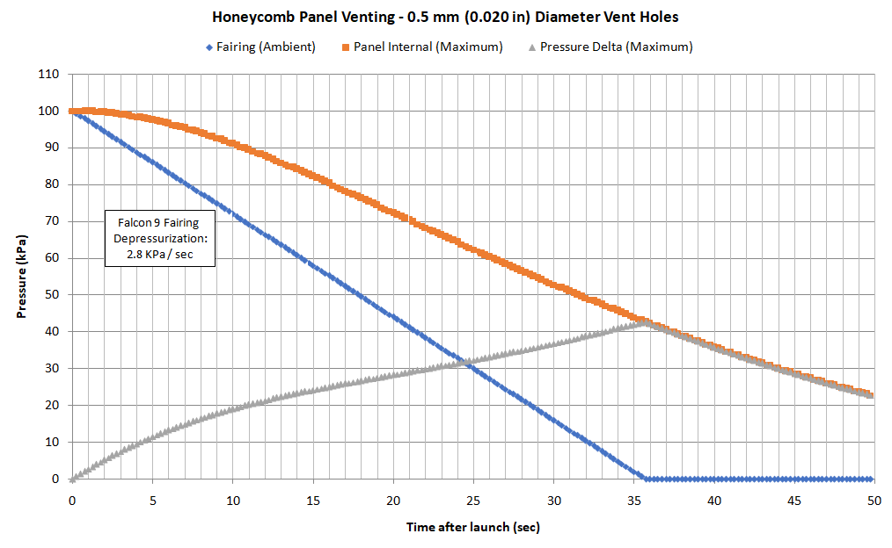

# Honeycomb Panel Venting Analysis
This script is used to predict the venting performance of MoonRangers radiator panel during launch and ascent within a Falcon 9 payload fairing. The radiator panel is constructed from a composite honeycomb panel with a perforated core. Internal over-pressure must be minimized to ensure structural integrity during ascent.

At every time step the mass flow into and out of every cell in the core is solved for based on the pressure of the 6 surrounding neighbor cells and then the cell pressure and discharge coefficient is updated. Cell data is stored in a 2D vector. Neighbors are accessed by their relative position to the current cell using an "off-set coordinate" method described here: https://www.redblobgames.com/grids/hexagons/

Example output here:

